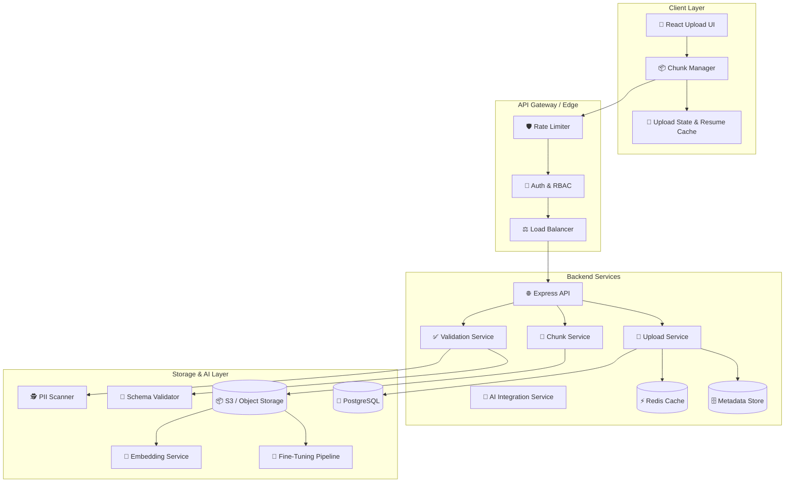
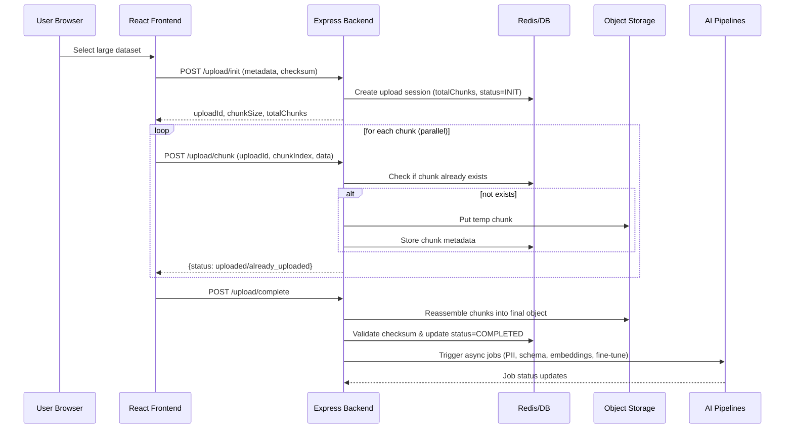

# 🚀 Resilient Dataset & Artifact Upload System

> **Full-Stack, Production-Ready, Resumable Uploads for AI Datasets & Artifacts**

<div align="center">


### 🎯 Production-Ready • Scalable • Resilient • AI-First

</div>

---

## 📚 Table of Contents

- [🏁 What This System Solves](#-what-this-system-solves)
- [🏗️ High-Level Architecture](#️-high-level-architecture)
- [✨ Core Capabilities](#-core-capabilities)
- [🎨 System Design View](#-system-design-view)
- [📁 Repository Structure](#-repository-structure)
- [🖥️ Frontend (React) Overview](#️-frontend-react-overview)
- [💻 Backend (Node/Express) Overview](#-backend-nodeexpress-overview)
- [🤖 AI Integration Points](#-ai-integration-points)
- [🚀 Deployment & Scaling](#-deployment--scaling)
- [📊 Observability & Performance](#-observability--performance)
- [🔒 Security & Compliance](#-security--compliance)
- [🧱 Future Evolution & System Design Notes](#-future-evolution--system-design-notes)

---

## 🏁 What This System Solves

Uploading large AI datasets and artifacts is **hard**:

- Networks are flaky.
- Browsers crash.
- Files are huge.
- Compliance & PII checks are non-negotiable.
- AI pipelines expect files to be validated, preprocessed, and cataloged.

This system provides a **resilient, resumable, chunked upload pipeline** with:

- **Chunk-level idempotency**
- **Auto-resume & missing-chunk discovery**
- **Backend reassembly into durable object storage (S3/MinIO)**
- **AI-specific plumbing** (validation, PII detection, fine-tuning & embeddings pipeline hooks)

---

## 🏗️ High-Level Architecture



---

## ✨ Core Capabilities

### 🎯 Upload & Resilience

- **Chunked Uploads** (default 1 MB chunks)
- **Parallel Uploads** with configurable concurrency
- **Idempotent Chunk Handling** via Redis metadata
- **Auto-Resume** by asking backend for **missing chunks**
- **End-to-End Progress Visualization** per chunk & overall %
- **Safe Retry** with exponential backoff

### 🤖 AI-First Features

- **Dataset Validation**
  - File type, size, checksum
  - Schema validation (JSON/JSONL/CSV etc.)
- **PII Detection**
  - Regex + ML-based scanning hooks
- **Metadata Extraction & Cataloging**
  - Dataset stats, fields, row counts, semantics
- **Pipeline Triggers**
  - Fine-tuning datasets
  - Embedding generation
  - Training/Indexing workflows

---

## 🎨 System Design View

### 🧩 Component Architecture

```text
┌─────────────────────────────────────────────────────────────┐
│                         Frontend (React)                   │
├─────────────────────────────────────────────────────────────┤
│  Upload UI  • Chunk Manager • State Machine • Resume Cache │
└─────────────────────────────────────────────────────────────┘
                 │                    ▲
                 ▼                    │
┌─────────────────────────────────────────────────────────────┐
│                    API Gateway / Edge                      │
│   HTTPS • Auth • Rate Limiting • Load Balancing            │
└─────────────────────────────────────────────────────────────┘
                 │
                 ▼
┌─────────────────────────────────────────────────────────────┐
│                   Backend (Express + TS)                    │
├─────────────────────────────────────────────────────────────┤
│ Routes • Controllers • Services • Validation • Metrics      │
└─────────────────────────────────────────────────────────────┘
       │             │                 │
       ▼             ▼                 ▼
┌──────────────┐ ┌──────────────┐ ┌──────────────┐
│  Redis Cache │ │ PostgreSQL   │ │ Object Store │
└──────────────┘ └──────────────┘ └──────────────┘
       │                                │
       └──────►   AI Pipelines & Jobs ◄─┘
                 (Fine-tuning, Embeddings, PII, etc.)
```

### 🔁 End-to-End Upload Flow



---

## 📁 Repository Structure

```bash
.
├── README.md                # 🔹 This file – global overview
├── docker-compose.yml       # Local infra stack (backend, frontend, redis, db, minio, nginx)
├── nginx.conf               # Optional edge configuration
├── backend/                 # 🌐 Node.js + Express backend
│   ├── README.md            # Backend-specific docs & system design
│   └── src/...
└── frontend/                # 🎨 React upload UI
    ├── README.md            # Frontend-specific docs & UX/state design
    └── src/...
```

> 🔎 For more detailed implementation docs, see:
> - `backend/README.md`
> - `frontend/README.md`

---

## 🖥️ Frontend (React) Overview

- Written in **TypeScript + React 18**
- Uses **styled-components** and **Framer Motion** for rich UX
- Implements:
  - Drag & drop upload
  - Visual chunk grid (per-chunk status)
  - Pause / Resume
  - Retry failed chunks
  - Real-time progress bars

The frontend exposes a single main component:

- `AIUploadSystem` – orchestrates:
  - **Initialization** (`/upload/init`)
  - **Chunking & queueing**
  - **Parallel uploads & retries**
  - **Completion call** (`/upload/complete`)

👉 See **`frontend/README.md`** for:
- State machine diagram
- Component breakdown
- How chunk scheduling & retries work
- Theming and customization

---

## 💻 Backend (Node/Express) Overview

- **Node.js 18+**, **Express**, **TypeScript**
- **Redis** for chunk metadata & idempotency
- **PostgreSQL** (or any RDBMS) for upload sessions
- **S3 / MinIO** for durable storage
- Pluggable services:
  - `UploadService`, `ChunkService`, `ValidationService`, `AIIntegrationService`

Key endpoints:

| Method | Path                     | Purpose                          |
|--------|--------------------------|----------------------------------|
| POST   | `/api/upload/init`       | Create an upload session         |
| POST   | `/api/upload/chunk`      | Upload an individual chunk       |
| GET    | `/api/upload/status/:id` | Check status + missing chunks    |
| POST   | `/api/upload/complete`   | Finalize upload & trigger AI     |

👉 See **`backend/README.md`** for:
- Detailed API contracts
- Data model diagrams
- System design (idempotency, consistency, failure handling)
- How reassembly & cleanup work

---

## 🤖 AI Integration Points

The backend exposes **integration hooks** to plug in your AI infra:

- **PII Detection & Compliance**
- **Schema validation & transformation**
- **Fine-tuning Dataset Preparation**
- **Embedding Generation & Vector DB Upserts**
- **Custom ML / ETL Jobs**

You can implement these by extending `AIIntegrationService` and calling out to:

- Internal ML services
- LLM APIs
- Vector DBs (Pinecone, Qdrant, PGVector, etc.)

Sample pseudo-flow:

```text
Upload Completed
   └─► PII Scan
         ├─► PASS → Schema Validation → Metadata Stats → Route to:
         │       ├─► Fine-tuning Jobs
         │       ├─► Embedding Generation
         │       └─► Training / Indexing Pipelines
         └─► FAIL → Quarantine dataset + notify / block usage
```

---

## 🚀 Deployment & Scaling

Supported deployment patterns:

- **Docker Compose** for local / single-node setups
- **Kubernetes** for horizontal scaling:
  - Multi-replica backend
  - HPA based on CPU/memory
  - Persistent Volumes for temp upload buffer if needed
- **Object Storage** decouples storage from compute
- **Redis** as a distributed coordination layer for:
  - Chunk tracking
  - Session state
  - Rate limiting

See the **docker-compose** and **K8s** manifests in this repo and adapt for your environment.

---

## 📊 Observability & Performance

Backend exposes metrics (e.g., via **Prometheus**):

- `uploads_total{status, file_type}`
- `upload_duration_seconds`
- `chunks_uploaded_total{status}`
- `active_uploads`

Design targets:

- P95 upload-related API latency `< 500ms`
- Chunk success rate `> 99.5%`
- Resume success rate `> 95%`
- Concurrent uploads: 1,000+ (with proper tuning)

---

## 🔒 Security & Compliance

Security features baked in:

- **Auth & RBAC**
- **Strict file-type and size validation**
- **Checksum validation**
- **Rate limiting & DDoS mitigation**
- **PII detection hooks** for GDPR/other regs
- **Audit logging** for all critical operations
- **Secure temporary storage and cleanup**

---

## 🧱 Future Evolution & System Design Notes

This system is designed to evolve:

- **From single-node to distributed:**
  - Move from local temp dir to object storage only
  - Use **multi-part uploads** directly to S3 via **pre-signed URLs**
  - Offload CPU-heavy transforms to background workers / queues

- **Consistency & Resilience:**
  - At-least-once delivery of chunks + idempotency
  - Exactly-once semantics for final assembled object
  - Handling **partial failures** (chunk uploaded but Redis metadata lost, etc.)

- **Edge Integration:**
  - API Gateway / sidecar proxies for:
    - mTLS & Auth
    - WAF rules
    - Request shaping / throttling
    - Model-serving adjacency for generated artifacts

For deeper, service-level system design details, see:

- `backend/README.md` – **backend system design**
- `frontend/README.md` – **client-side resilience design**

---

<div align="center">

### 🌟 Built for AI Engineering Teams Who Care About Reliability 🌟

</div>
