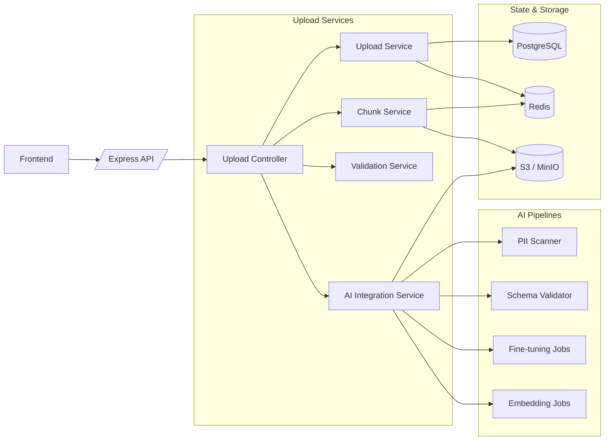
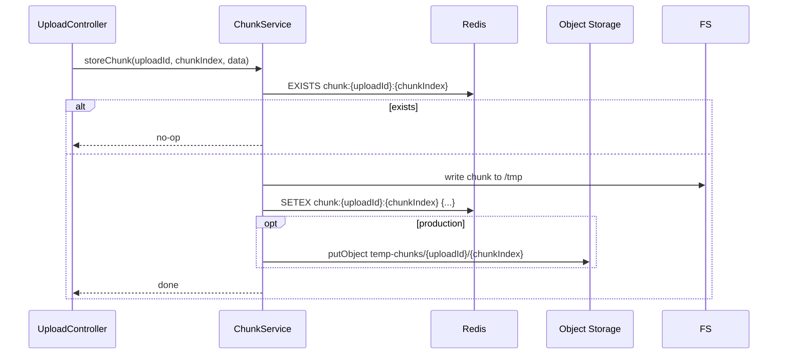

# 💻 Backend – Resilient Dataset & Artifact Upload API

> **Node.js + Express + TypeScript backend for resumable, AI-aware uploads**

---

## 📚 Table of Contents

- [🏁 Overview](#-overview)
- [🏗️ Backend Architecture](#️-backend-architecture)
- [🧱 System Design Concepts](#-system-design-concepts)
- [🧩 Project Structure](#-project-structure)
- [🌐 API Design](#-api-design)
- [🗂️ Data Model & Storage](#️-data-model--storage)
- [📦 Chunk Handling & Reassembly](#-chunk-handling--reassembly)
- [🤖 AI Integration Service](#-ai-integration-service)
- [📊 Observability & Metrics](#-observability--metrics)
- [🔒 Security & Hardening](#-security--hardening)
- [⚙️ Local Development & Running](#️-local-development--running)
- [🧱 Evolution: From Single Node to Distributed](#-evolution-from-single-node-to-distributed)

---

## 🏁 Overview

The backend is responsible for:

- **Managing upload sessions** and their lifecycle
- **Accepting chunked uploads** in an idempotent way
- **Reassembling chunks** into final objects
- **Validating** size, type, checksum, schema
- **Triggering AI pipelines** (fine-tuning, embeddings, training)
- Providing **status, progress, and missing-chunk info** to the frontend

It is designed to be:

- **Horizontally scalable**
- **Stateless at the app layer**
- **Backed by Redis + PostgreSQL + Object Storage**

---

## 🏗️ Backend Architecture



### Key Components

- **UploadController**
  - Orchestrates requests: init, chunk, status, complete
- **UploadService**
  - Manages upload session metadata & state
- **ChunkService**
  - Stores/retrieves chunk data, reassembles final files
- **ValidationService**
  - Validates types, checksum, etc.
- **AIIntegrationService**
  - Pluggable hooks into AI jobs and pipelines

---

## 🧱 System Design Concepts

### 1. Idempotency

- Each chunk is uniquely identified by `(uploadId, chunkIndex)`.
- Redis key: `chunk:{uploadId}:{chunkIndex}`.
- If a chunk is re-sent:
  - Backend checks Redis → if present, returns **already_uploaded**.
  - Prevents double writes & inconsistent reassembly.

### 2. Resumability

- Upload session tracks:
  - `totalChunks`
  - `uploadedChunks`
  - `status`
- `GET /status/:uploadId` returns:
  - **Which chunks are missing**.
- Frontend only sends missing chunks on resume.

### 3. Consistency Model

- **Eventually consistent** chunk metadata in Redis / S3.
- Final object is written only when:
  - All chunks are present.
  - Checksum validation passes.
- Upload session state transitions:
  - `INIT` → `UPLOADING` → `ASSEMBLING` → `COMPLETED` or `FAILED`.

### 4. Failure Handling

- **Network failures**: chunks are retried (frontend) with backoff.
- **Chunk processing failures**: logged and tracked as `failedChunks`.
- **Auto-complete**:
  - When last chunk arrives, backend may trigger `completeUploadAsync`.

---

## 🧩 Project Structure

```bash
backend/
├── src/
│   ├── app.ts                # Express app bootstrap
│   ├── config/
│   │   ├── database.ts       # PostgreSQL connection
│   │   ├── redis.ts          # Redis client
│   │   └── storage.ts        # S3/MinIO configuration
│   ├── controllers/
│   │   └── uploadController.ts
│   ├── middleware/
│   │   ├── auth.ts
│   │   ├── rateLimit.ts
│   │   ├── validation.ts
│   │   └── errorHandler.ts
│   ├── models/
│   │   ├── Upload.ts         # Upload session model
│   │   └── Chunk.ts          # Chunk model / types
│   ├── services/
│   │   ├── uploadService.ts
│   │   ├── chunkService.ts
│   │   ├── validationService.ts
│   │   └── aiIntegration.ts
│   ├── routes/
│   │   └── uploadRoutes.ts
│   ├── utils/
│   │   ├── logger.ts
│   │   └── errors.ts
│   └── metrics/
│       └── metricsCollector.ts
├── tests/
│   ├── integration/
│   └── unit/
├── package.json
└── tsconfig.json
```

---

## 🌐 API Design

### 1. `POST /api/upload/init`

**Purpose:** Start a new upload session.

**Request Body**

```json
{
  "fileName": "dataset.jsonl",
  "fileSize": 123456789,
  "fileType": "application/json",
  "checksum": "sha256:....",
  "metadata": {
    "purpose": "training",
    "schema": "auto-detect"
  }
}
```

**Response**

```json
{
  "uploadId": "upl_123abc",
  "chunkSize": 1048576,
  "totalChunks": 118,
  "uploadUrl": "/api/upload/chunk",
  "expiresAt": "2025-01-01T00:00:00.000Z"
}
```

### 2. `POST /api/upload/chunk`

**Purpose:** Upload a single chunk (idempotent).

**Request Body**

```json
{
  "uploadId": "upl_123abc",
  "chunkIndex": 0,
  "totalChunks": 118,
  "data": "<base64-encoded-bytes>"
}
```

**Response (new chunk)**

```json
{
  "chunkIndex": 0,
  "status": "uploaded",
  "progress": {
    "uploaded": 1,
    "total": 118,
    "percentage": 0.85
  }
}
```

**Response (already uploaded)**

```json
{
  "chunkIndex": 0,
  "status": "already_uploaded",
  "message": "Chunk already uploaded successfully"
}
```

### 3. `GET /api/upload/status/:uploadId`

**Purpose:** Get upload progress and missing chunks.

**Response**

```json
{
  "uploadId": "upl_123abc",
  "fileName": "dataset.jsonl",
  "fileSize": 123456789,
  "totalChunks": 118,
  "uploadedChunks": 100,
  "missingChunks": [3, 7, 8, 21, ...],
  "status": "UPLOADING",
  "createdAt": "2025-01-01T00:00:00.000Z",
  "expiresAt": "2025-01-02T00:00:00.000Z"
}
```

### 4. `POST /api/upload/complete`

**Purpose:** Validate and assemble chunks, then trigger AI pipeline.

**Request Body**

```json
{ "uploadId": "upl_123abc" }
```

**Response**

```json
{
  "uploadId": "upl_123abc",
  "status": "completed",
  "filePath": "datasets/upl_123abc/upl_123abc_final",
  "message": "Upload completed successfully, AI processing initiated",
  "aiPipeline": {
    "status": "initiated",
    "estimatedTime": "5-10 minutes"
  }
}
```

---

## 🗂️ Data Model & Storage

### Upload Session

```text
Upload
------
uploadId: string (PK)
userId: string
fileName: string
fileSize: number
fileType: string
checksum: string
totalChunks: number
status: INIT | UPLOADING | ASSEMBLING | COMPLETED | FAILED
filePath: string | null
metadata: JSONB
createdAt: timestamp
updatedAt: timestamp
expiresAt: timestamp
```

### Chunk Metadata (Redis)

Each chunk: `chunk:{uploadId}:{chunkIndex}` → JSON:

```json
{
  "path": "/tmp/uploads/upl_123abc/chunk_0",
  "size": 1048576,
  "uploadedAt": "2025-01-01T00:01:23.000Z",
  "checksum": "md5:..."
}
```

### Storage Strategy

- **Temp storage**: Local FS + Redis metadata
- **Durable storage**: S3/MinIO bucket
  - `temp-chunks/{uploadId}/{chunkIndex}`
  - `datasets/{uploadId}/{finalFileName}`

---

## 📦 Chunk Handling & Reassembly

### Store Chunk Flow



### Reassembly

1. List all chunk keys for `uploadId`.
2. Sort by `chunkIndex`.
3. Stream merge chunks into `*_final` file.
4. Optionally upload final file to S3 as `datasets/{uploadId}/...`.
5. Cleanup:
   - Delete Redis keys
   - Remove local temp folder
   - Delete S3 temp chunks

---

## 🤖 AI Integration Service

`AIIntegrationService` is where you plug your ML stack:

Example responsibilities:

- `scanForPII(filePath)`
- `validateSchema(filePath, expectedSchema)`
- `generateMetadata(filePath)`
- `triggerFineTuning(filePath, metadata)`
- `generateEmbeddings(filePath)`
- `prepareTrainingDataset(filePath)`
- `indexDataset(filePath, metadata)`

You can connect this to:

- Queues (e.g., Kafka, SQS, RabbitMQ)
- Internal ML microservices
- External AI APIs

---

## 📊 Observability & Metrics

- **Request logging** via `logger.ts`
- **Metrics** (e.g. Prometheus):

  - `uploads_total{status, file_type}`
  - `upload_duration_seconds`
  - `chunks_uploaded_total{status}`
  - `active_uploads`

Use these to build dashboards for:

- Success/failure rates
- P95 latency
- Throughput per file type
- Top users / dataset sizes

---

## 🔒 Security & Hardening

Key considerations:

1. **Authentication & Authorization**
   - JWT / OAuth2 / API keys
   - Role-based access to upload endpoints

2. **Input Validation**
   - Validate `fileType`, `fileSize`, `metadata`
   - Harden against injection & malformed JSON

3. **Rate Limiting**
   - Per IP / per user
   - Burst limits on `/chunk`

4. **Transport Security**
   - TLS termination at edge (Nginx/API Gateway)
   - mTLS for internal services if needed

5. **Compliance**
   - PII detection & redaction flows
   - Data retention / deletion policies
   - Audit log for critical operations

---

## ⚙️ Local Development & Running

### Prerequisites

- Node.js 18+
- Docker (for Redis, Postgres, Minio) – or real services
- Yarn / npm

### Quick Start

```bash
# From backend/
cp .env.example .env   # configure DB, Redis, S3
npm install
npm run dev            # nodemon / ts-node dev mode
```

Or using Docker Compose from repo root:

```bash
docker-compose up --build
```

The backend will be available at: `http://localhost:3000`.

---

## 🧱 Evolution: From Single Node to Distributed

The current design already uses Redis + S3 and can scale horizontally. To go fully distributed and cloud-native:

1. **API Gateway & Sidecars**
   - Move rate limiting and auth to API gateway (Kong, NGINX, Envoy).
   - Use sidecars for:
     - mTLS
     - Retries
     - Circuit breaking

2. **Direct-to-S3 Multipart Uploads**
   - Frontend uploads directly to S3 using pre-signed URLs.
   - Backend only:
     - Issues pre-signed URLs
     - Validates manifest and checksum
     - Triggers AI pipelines

3. **Clock Skew & Time-Based Logic**
   - Avoid relying on local timestamps for correctness.
   - Use DB timestamps for `expiresAt`.
   - Tolerate skew in TTLs and background cleanup.

4. **Retries & Partial Failures**
   - Use idempotent job IDs for AI pipelines.
   - Retry-friendly reassembly & AI triggers with exactly-once semantics via:
     - Outbox patterns
     - Job status tables

5. **Multi-Region Setup**
   - S3 cross-region replication.
   - Redis clusters and Postgres replicas.
   - Global load balancing at the edge.

This progression lets you evolve from **local PoC** → **single region** → **multi-region distributed upload platform** without redesigning fundamentals.

---
