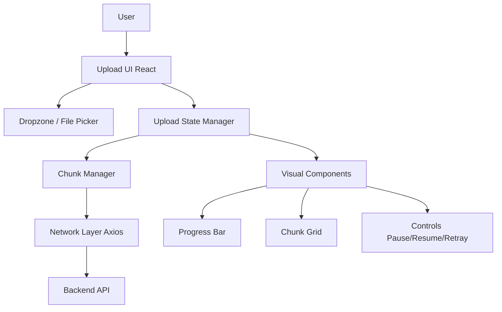
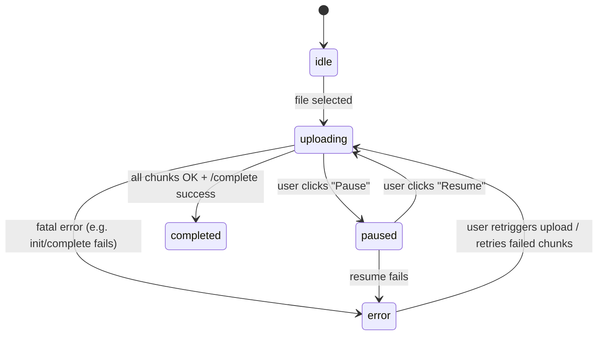

# 🎨 Frontend – Resilient AI Dataset Upload UI

> **React-based, visually rich upload client with chunking, resume, and detailed progress**

---

## 📚 Table of Contents

- [🏁 Overview](#-overview)
- [🎨 UX Goals](#-ux-goals)
- [🏗️ Frontend Architecture](#️-frontend-architecture)
- [🔁 Upload State Machine](#-upload-state-machine)
- [🧠 Core Concepts](#-core-concepts)
- [📦 Chunking & Parallel Uploads](#-chunking--parallel-uploads)
- [🧱 Component Breakdown](#-component-breakdown)
- [⚙️ Configuration](#️-configuration)
- [🚀 Running Locally](#-running-locally)
- [🧩 Extensibility Ideas](#-extensibility-ideas)

---

## 🏁 Overview

The frontend provides a **single, high-quality upload experience** for large AI datasets:

- Drag-and-drop upload surface
- Visual chunk grid (per-chunk status)
- Smooth animated progress bar
- Pause & resume capability
- Retry failed chunks
- Integrates with the backend’s chunked upload API

Main entry point: `AIUploadSystem` React component.

---

## 🎨 UX Goals

- **Clarity:** Show exactly what’s happening (how many chunks, which ones failed).
- **Confidence:** Users see progress, not a single spinner.
- **Resilience:** 
  - Safe to refresh page and resume (when wired to persistent storage).
  - Clear messages on failure.
- **Delight:** Modern, animated UI using **Framer Motion** and **styled-components**.

---

## 🏗️ Frontend Architecture



### Key Ideas

- **Functional core** (state, chunk scheduling) is isolated from:
  - **Visual shell** (animation, layout).
- Upload logic is implemented primarily inside `AIUploadSystem` using:
  - `useState`
  - `useCallback`
  - `useEffect`

---

## 🔁 Upload State Machine

Conceptually, the upload process behaves like this:



Each chunk has its own **local status**:

- `pending`
- `uploading`
- `success`
- `error`

The global upload state aggregates these per-chunk statuses.

---

## 🧠 Core Concepts

### UploadState Shape

```ts
interface UploadState {
  uploadId: string | null;
  fileName: string;
  fileSize: number;
  totalChunks: number;
  uploadedChunks: Set<number>;
  failedChunks: Set<number>;
  status: 'idle' | 'uploading' | 'paused' | 'completed' | 'error';
  progress: number; // 0–100
}
```

### Main Hooks & Responsibilities

- `useDropzone` (from `react-dropzone`)
  - Handles drag & drop + file selection
- Local helpers:
  - `initializeUpload(file)` → calls `/upload/init`
  - `processUpload(file, resumeUploadId?)` → orchestrates chunking & scheduling
  - `uploadChunk(...)` → upload a single chunk with retries
  - `completeUpload(uploadId)` → calls `/upload/complete`

---

## 📦 Chunking & Parallel Uploads

### Chunking Strategy

- Default chunk size: `1 MB` (`CHUNK_SIZE = 1024 * 1024`)
- For a file size `file.size`, chunks are:

```ts
const totalChunks = Math.ceil(file.size / CHUNK_SIZE);

for (let i = 0; i < totalChunks; i++) {
  const start = i * CHUNK_SIZE;
  const end = Math.min(start + CHUNK_SIZE, file.size);
  const chunk = file.slice(start, end);
}
```

### Parallelism

- `PARALLEL_UPLOADS = 5` by default.
- We maintain a queue of pending uploads and run at most 5 at a time.

### Retry Logic

- Each chunk makes up to `retries = 3` attempts.
- On failure:
  - Exponential backoff: `2^attempt * 1000` ms.
  - Marked as `failedChunk`.
  - User can **Retry Failed Chunks** via a button.

---

## 🧱 Component Breakdown

### 1. `UploadContainer`

- Main layout (max width, padding, typography).
- Provides the visual context.

### 2. `DropzoneArea`

- Animated, gradient background.
- Shows:
  - “Drag & drop your dataset here”
  - Supported file types hint.
- Changes appearance on drag-over (`isDragActive`).

### 3. `ProgressBar` & `ProgressFill`

- Horizontal bar showing overall upload percentage.
- Animated width using `Framer Motion`.

### 4. `ChunkStatus` & `Chunk`

- Grid that visually represents each chunk as a colored square:

  - Grey → `pending`
  - Yellow/Orange → `uploading`
  - Green → `success`
  - Red → `error`

- Each chunk has a tooltip (`title`) & label with its index.

### 5. Controls

- Buttons (styled with gradients + motion):
  - `⏸️ Pause Upload`
  - `▶️ Resume Upload`
  - `🔄 Retry Failed Chunks (N)`

- Optional success panel on completion:
  - “✅ Upload Complete! AI processing initiated…”

---

## ⚙️ Configuration

Environment variables:

```bash
REACT_APP_API_URL=http://localhost:3000/api
```

In code:

```ts
const API_BASE = process.env.REACT_APP_API_URL || 'http://localhost:3000/api';
const CHUNK_SIZE = 1024 * 1024; // 1MB
const PARALLEL_UPLOADS = 5;     // concurrent chunks
```

You can tune:

- `CHUNK_SIZE` (trade-off between overhead & failure scope).
- `PARALLEL_UPLOADS` (network + backend throughput).

---

## 🚀 Running Locally

### Prerequisites

- Node.js 18+
- Backend running at `http://localhost:3000` (or update `REACT_APP_API_URL`)

### Steps

```bash
# From frontend/
cp .env.example .env           # Set REACT_APP_API_URL if needed
npm install
npm start
```

Or via Docker Compose from repo root:

```bash
docker-compose up --build
```

The frontend will be available at: `http://localhost:3001`.

---

## 🧩 Extensibility Ideas

You can easily extend the frontend to:

1. **Support Multiple File Uploads**
   - Use an array of `UploadState` objects.
   - Render a list of cards, one per file.

2. **Persist Resume State**
   - Save `uploadId`, `fileName`, `uploadedChunks` to:
     - `localStorage`
     - `IndexedDB`
   - On page refresh, offer “Resume upload” if a matching session exists.

3. **Integrate Authentication**
   - Attach `Authorization: Bearer <token>` headers via Axios interceptors.
   - Hide/upload UI until user is authenticated.

4. **Advanced Telemetry**
   - Track timing per chunk.
   - Log stats to an analytics endpoint.

5. **Theming**
   - Extract gradients, fonts, and sizes to a theme object.
   - Support dark/light mode toggling.

---

With this frontend in place, you get a **clean, powerful UX** that fully leverages the backend’s **chunked, resumable, AI-ready upload capabilities**.

---
